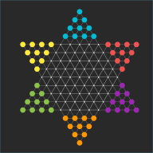

# A Collection of Boardgames

Based on a Express Backend with Socket.IO and a React frontend.



## Games

* Halma
* Mühle
* Dame

## Development

```
cd frontend
yarn install
yarn start
```

```
cd backend
yarn install
yarn dev
```

## Docker

```
podman build -t halma .
podman run -p 3030:3030 -d halma
```
